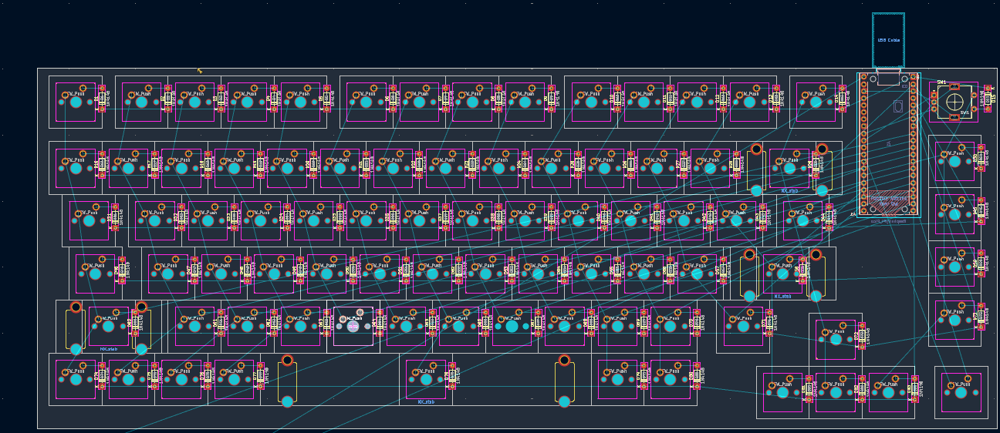
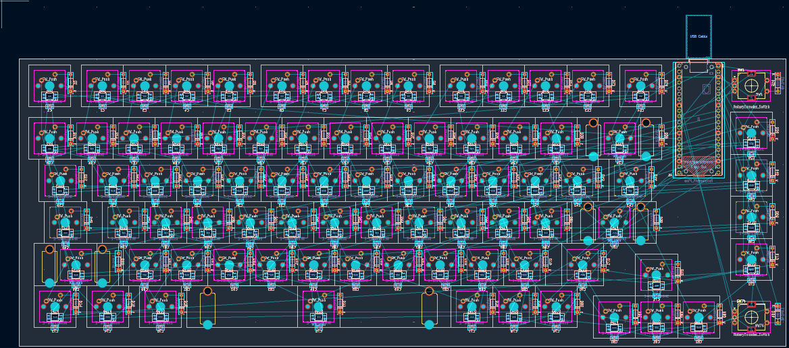
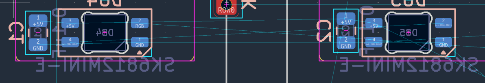

# Work logs  

## 1. Keyboard schematic (5 hours 17 mins)  

I am almost done with the schematic! I am only missing the footprints. I added RGBs, an RGB toggle switch, and a rotary encoder to my keyboard schematic.

**Problems I encountered:**

I got stuck on the labels and had to redo the circuits a few times.

I also realized after copy-pasting all my RGB circuits that my capacitors weren't connected to my VDDs, so I had to manually rewire all 83 of them.

I also ran into some issues with formatting the journal markdown and committing on github.

## 2. Keyboard PCB (5 hours 54 mins)

**Problems I encountered:**

I messed up the grid and took too long before realizing it. I had to search online for the size of the keyboard and the keys and redo my layout.  

 

**What I did:**

I added the footprints and placed the switches and the microcontroller on the PCB. I also removed the extra switch and RGB I had. I also changed the capacitors to bigger ones, so instead of 0603 I am now using 0805.

**Potential issues:**

The microcontroller seems too close to the switches beside it.

## 3. Diodes PCB (2 hours 5 mins)

**What I did:**

I added the diodes in my PCB and fixed a few switch alignments.

**Problems I encountered:**

To make the diodes' ratsnest align with their corresponding switch, I had to snap the diodes' pin onto the switches' pin and then place them. Doing this manually took a lot longer than expected, maybe I should have just changed to a really smaller grid size.

**Issues to fix:**

The 2u stabilizers are overlapping with the diodes.

## 4. RGB PCB (4 hours 26 mins)

**What I did:**

* I added the RGB LEDs and the capacitors in my PCB.

* I fixed the overlapping issue by moving the diodes a bit further away from the 2u stabilizers. I also flipped the diodes on the back layer for a cleaner front layer.
* I realized that my bottom-left keys (such as "Ctrl", "Windows", and "Alt") were actually 1.25u, instead of 1u, so I had to redo the bottom row's layout.  
* Finding a fitting tactile switch and its cap was difficult, so I changed the RGB toggle switch to a rotary encoder, which offers more flexibility for RGB control.

**Problems I encountered:**
* Managing the grid snapping and spacing for the capacitors was difficult when placing them to the left of the RGB LEDs. I ended up placing them underneath the RGB LEDs instead.

