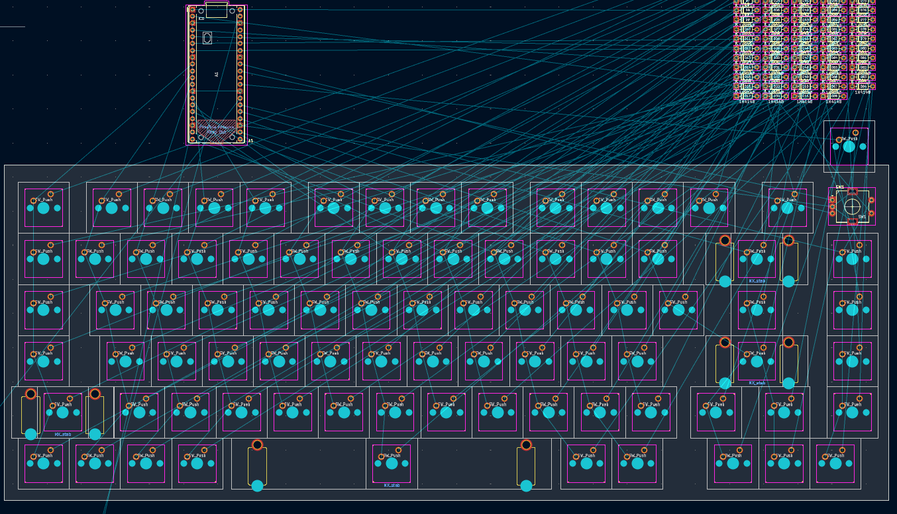
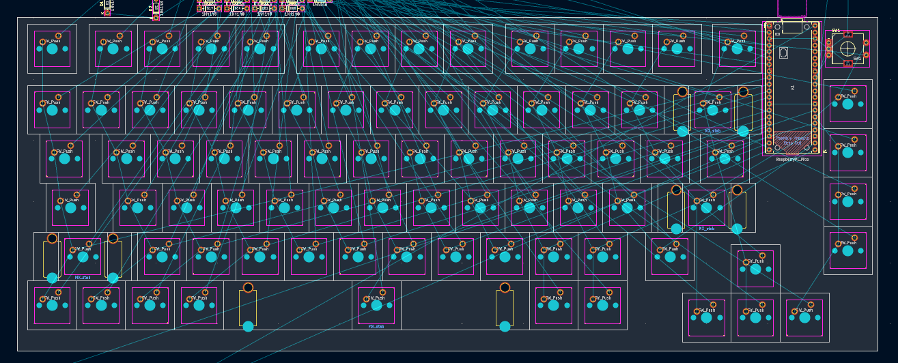

# Work logs  

## 1. Keyboard schematic (5 hours 17 mins)  

I am almost done with the schematic! I am only missing the footprints. I added RGBs, an RGB toggle switch, and a rotary encoder to my keyboard schematic.

**Problems I encountered:**

I got stuck on the labels and had to redo the circuits a few times.

I also realized after copy-pasting all my RGB circuits that my capacitors weren't connected to my VDDs, so I had to manually rewire all 83 of them.

I also ran into some issues with formatting the journal markdown and committing on github.

## 2. Keyboard PCB (5 hours 54 mins)

**Problems I encountered:**

I messed up the grid and took too long before realizing it. I had to search online for the size of the keyboard and the keys and redo my layout.  

 

**What I did:**

I added the footprints and placed the switches and the microcontroller on the PCB. I also removed the extra switch and RGB I had. I also changed the capacitors to bigger ones, so instead of 0603 I am now using 0805.

**Potential issues:**

The microcontroller seems too close to the switches beside it.